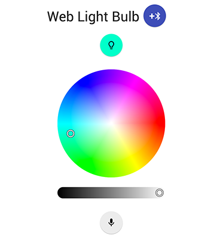

# Smart-lightbulb

> Control your [Smart Bluetooth Bulb](http://www.gearbest.com/smart-light-bulb/pp_230349.html) through the Web! 

Read about this project in [urish](https://github.com/urish) blog post: 

* [Start Building with Web Bluetooth and Progressive Web Apps](https://medium.com/@urish/start-building-with-web-bluetooth-and-progressive-web-apps-6534835959a6#.qf1r3ato3) 
* [Reverse Engineering a Bluetooth Lightbulb](https://medium.com/@urish/reverse-engineering-a-bluetooth-lightbulb-56580fcb7546#.puoo705sd)

Currently works only with Chrome 53 or newer.

➡ [Online Demo](https://sagi363.github.io/smart-lightbulb/)

## Credit
> Created by: [urish](https://github.com/urish)
